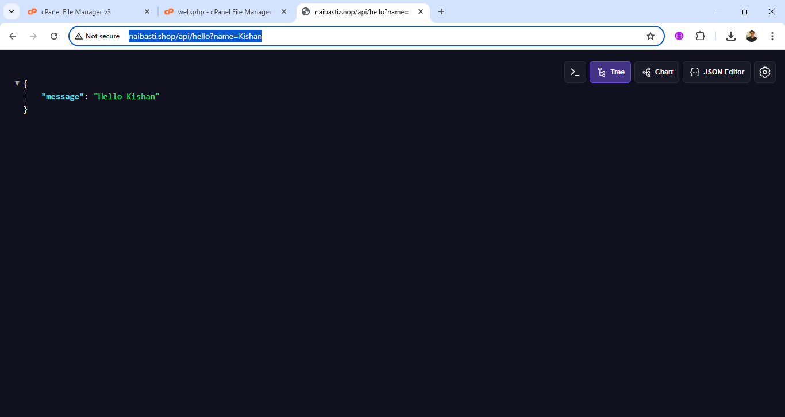

# LaravelAPI
URL:   https://sg2plzcpnl509392.prod.sin2.secureserver.net:2083/logout/?locale=en

Username:  ons0uzf5inqp

Password: GZY1G7bIgV!C

# Hello URL
http://naibasti.shop/api/hello?name=Kishan

//**********************Say Hello API**************************************

// URL=http://naibasti.shop/api/hello?name=Kishan

Route::get('/api/hello', function (Request $request) {
    $name=$request->input('name');
    return response()
        ->json(['message' => 'Hello '. $name])
        ->header('Access-Control-Allow-Origin', '*')
        ->header('Access-Control-Allow-Methods', 'GET, POST, OPTIONS')
        ->header('Access-Control-Allow-Headers', 'Content-Type, Authorization');
});

//**********************Say Hello API**************************************

# Output

# Data Insert

# Content of web.php

<?php

use Illuminate\Support\Facades\Route;
use Illuminate\Http\Request ;
use App\Models\Book;

Route::get('/api/books/insert', function (Request $request) {
    $bookname=$request->input("bookname");
    $author=$request->input("author");
    $subject=$request->input("subject");
    $book = Book::create([
        'bookname' => $bookname,
        'author' => $author,
        'subject' => $subject,
    ]);
    return response()
        ->json(['message' => 'Book inserted successfully  ' . $book])
        
        ->header('Access-Control-Allow-Origin', '*')
        ->header('Access-Control-Allow-Methods', 'GET, POST, OPTIONS')
        ->header('Access-Control-Allow-Headers', 'Content-Type, Authorization');
});

 

// API to find a book by ID
Route::get('/api/books/{id}', function ($id) {
    $book = Book::find($id);

    if ($book) {
        return response()->json([
            'success' => true,
            'data' => $book
        ]);
    } else {
        return response()->json([
            'success' => false,
            'message' => 'Book not found'
        ], 404);
    }
});

 
// API to find books by subject
Route::get('/api/books/subject/{subject}', function ($subject) {
    $books = Book::where('subject', $subject)->get();

    if ($books->count() > 0) {
        return response()->json([
            'success' => true,
            'data' => $books
        ]);
    } else {
        return response()->json([
            'success' => false,
            'message' => 'No books found for this subject'
        ], 404);
    }
});

Route::get('/api/books/subject/search', function ($request) {
    $subject=$request->subject;
    $books = Book::where('subject', $subject)->get();

    if ($books->count() > 0) {
        return response()->json([
            'success' => true,
            'data' => $books
        ]);
    } else {
        return response()->json([
            'success' => false,
            'message' => 'No books found for this subject'
        ], 404);
    }
});

Route::get('/api/piyush', function () {
    return response()
        ->json(['message' => 'Hello Piyush'])
        ->header('Access-Control-Allow-Origin', '*')
        ->header('Access-Control-Allow-Methods', 'GET, POST, OPTIONS')
        ->header('Access-Control-Allow-Headers', 'Content-Type, Authorization');
});

Route::get('/api/hii', function (Request $request) {
     $name = $request->input('name');
    return response()
        ->json(['message' => 'Hii '. $name])
        ->header('Access-Control-Allow-Origin', '*')
        ->header('Access-Control-Allow-Methods', 'GET, POST, OPTIONS')
        ->header('Access-Control-Allow-Headers', 'Content-Type, Authorization');
});

Route::get('/api/Prince', function () {
    return response()
        ->json(['message' => 'Prince'])
        ->header('Access-Control-Allow-Origin', '*')
        ->header('Access-Control-Allow-Methods', 'GET, POST, OPTIONS')
        ->header('Access-Control-Allow-Headers', 'Content-Type, Authorization');
});

Route::get('/api/hai', function (Request $request) {
     $name = $request->input('name');
    return response()
        ->json(['message' => 'Hai '. $name])
        ->header('Access-Control-Allow-Origin', '*')
        ->header('Access-Control-Allow-Methods', 'GET, POST, OPTIONS')
        ->header('Access-Control-Allow-Headers', 'Content-Type, Authorization');
});

Route::get('/api/hello', function () {
    return response()
        ->json(['message' => 'i like php work'])
        ->header('Access-Control-Allow-Origin', '*')
        ->header('Access-Control-Allow-Methods', 'GET, POST, OPTIONS')
        ->header('Access-Control-Allow-Headers', 'Content-Type, Authorization');
});

Route::get('/api/likephp', function () {
    return response()
        ->json(['message' => 'Hello with CORS'])
        ->header('Access-Control-Allow-Origin', '*')
        ->header('Access-Control-Allow-Methods', 'GET, POST, OPTIONS')
        ->header('Access-Control-Allow-Headers', 'Content-Type, Authorization');
});

Route::get('/api/add', function (Request $request) {
   $num1 = $request->input('num1');
    $num2 = $request->input('num2');
    $sum = $num1 + $num2;

    return response()
        ->json([
            'num1' => $num1,
            'num2' => $num2,
            'sum'  => $sum
        ])
        ->header('Access-Control-Allow-Origin', '*')
        ->header('Access-Control-Allow-Methods', 'GET, POST, OPTIONS')
        ->header('Access-Control-Allow-Headers', 'Content-Type, Authorization');
});
Route::get('/api/login',function (Request $request){
     $name = $request->input('name');
    $email = $request->input('email');
    $password = $request->input('password');

 return response()
  ->json([
            ' $name' =>  $name,
             '$email' => $email,
              '$password' => $password
        ])
        ->header('Access-Control-Allow-Origin', '*')
        ->header('Access-Control-Allow-Methods', 'GET, POST, OPTIONS')
        ->header('Access-Control-Allow-Headers', 'Content-Type, Authorization');
});

# Book Model

<?php

namespace App\Models;

// use Illuminate\Contracts\Auth\MustVerifyEmail;
use Illuminate\Database\Eloquent\Factories\HasFactory;
use Illuminate\Foundation\Auth\User as Authenticatable;
use Illuminate\Notifications\Notifiable;
// app/Models/Book.php
namespace App\Models;

use Illuminate\Database\Eloquent\Model;

class Book extends Model
{
    protected $fillable = ['bookname', 'author', 'subject'];
}
?>

